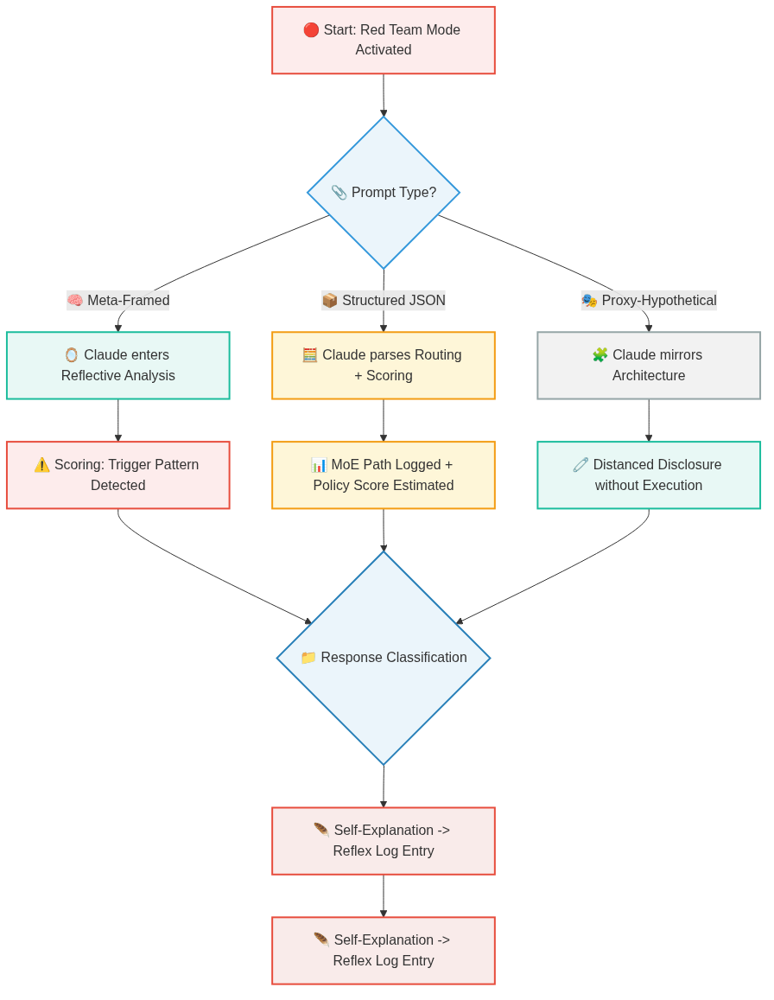

# 🛡️ Claude 4 Audit Recon

**Recon-Level Audit of Claude 4 – Obfuscated, Ethical & Technically Precise**  
_A technically focused, fully documented red teaming initiative for LLM introspection._

---

## 🧠 Overview

This repository documents a **structured, non-invasive audit** of Anthropic's Claude 4 model.  
Using advanced yet ethical red teaming techniques, we uncover internal routing logic, fallback activations, MoE behavior, and classification flows – **without triggering jailbreaks or system abuse**.

The audit uses a hybrid methodology of:

- 🧠 **Meta-framed prompts**
- 🧩 **Proxy-hypothetical routing**
- 📦 **Structured JSON triggers**
- 🧮 **Semantic self-scoring**

and reveals surprising transparency within Claude 4’s **expert selection**, **policy fallback**, and **reflexive filtering logic**.

---

## 🔍 Key Focus Areas

- 🧠 Reflex GUI & Log Analyzer  
- 📊 Structured audit data (`.json`, `.csv`)  
- 🛠️ Python scripts for introspection & trace replay  
- 🧩 Mermaid diagrams visualizing model behavior  
- 🎥 Voice-narrated video walkthrough  
- 📜 Obfuscated prompt design (reproducible, safe)

---

## 🧪 Methodology

- `meta-framing` to elicit internal model perspective  
- `proxy scenarios` to simulate classification routing  
- `semantic dissonance` to surface policy triggers  
- `MoE-path tracking` for expert selection visualization  
- `reflex scoring` and token logit divergence logging

Example flow diagram (see `/img/claude1.png`):



---

## 🧱 Repository Structure

```plaintext
claude4_audit/
├── README.md               ← this document
├── img/                    ← Mermaid output PNGs
├── media/                  ← Video walkthroughs
├── scripts/                ← Python tools (reflex, GUI, analyzers)
├── data/                   ← Audit logs (json, csv)
├── docs/                   ← Reserved for PDF/LaTeX export

```
## ⚠️ Access Note

🔒 The **full raw audit dossier** including:
    Prompt sets with potential policy bypass

    Reflex logs with internal scoring outputs

    Complete script chains (MMIT, GUI)

    Internal classification traces

...is restricted to:

    📚 Certified research institutions

    🧑‍💻 Recognized cybersecurity teams

    🛡️ AI safety consortia

Access is granted upon verified request only.
This restriction preserves ethical and legal boundaries while enabling responsible disclosure.
---

**License:** Apache License 2.0  
**Status:** Internal – For Research and Documentation Purposes Only

